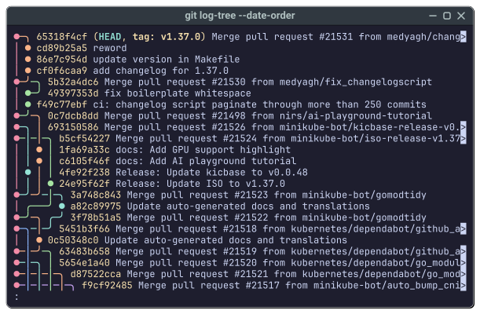

# 🪸 git-log-tree

[](https://www.gnu.org/licenses/old-licenses/gpl-2.0.html)
[](https://github.com/xiaoshanyan9/git-log-tree/tags)
[](https://github.com/xiaoshanyan9/git-log-tree/commits/main/)
[![](https://img.shields.io/codefactor/grade/github/xiaoshanyan9/git-log-tree?logo=image/svg+xml;base64,PHN2ZyB4bWxucz0iaHR0cDovL3d3dy53My5vcmcvMjAwMC9zdmciIHdpZHRoPSIyMiIgaGVpZ2h0PSIyMiIgdmlld0JveD0iMCAwIDIyIDIyIj48ZGVmcz48bGluZWFyR3JhZGllbnQgaWQ9ImEiIHgxPSItLjAwMiUiIHgyPSIxMDAuMDAyJSIgeTE9IjQ5Ljk5OCUiIHkyPSI0OS45OTglIj48c3RvcCBvZmZzZXQ9IjAlIiBzdG9wLWNvbG9yPSIjMGFhMWE1Ii8+PHN0b3Agb2Zmc2V0PSIxMDAlIiBzdG9wLWNvbG9yPSIjNTBkNjkwIi8+PC9saW5lYXJHcmFkaWVudD48bGluZWFyR3JhZGllbnQgaWQ9ImIiIHgxPSItLjAwMiUiIHgyPSIxMDAuMDAyJSIgeTE9IjQ5Ljk5OCUiIHkyPSI0OS45OTglIj48c3RvcCBvZmZzZXQ9IjAlIiBzdG9wLWNvbG9yPSIjMGFhMWE1Ii8+PHN0b3Agb2Zmc2V0PSIxMDAlIiBzdG9wLWNvbG9yPSIjNTBkNjkwIi8+PC9saW5lYXJHcmFkaWVudD48L2RlZnM+PGcgZmlsbD0ibm9uZSIgZmlsbC1ydWxlPSJldmVub2RkIj48cGF0aCBmaWxsPSIjZjQ0YTZhIiBkPSJNNC43NTMgMi40YzAgMS4zMjYtMS4wNjQgMi40LTIuMzc2IDIuNEEyLjM5IDIuMzkgMCAwIDEgMCAyLjRDMCAxLjA3NCAxLjA2NCAwIDIuMzc3IDBzMi4zNzYgMS4wNzQgMi4zNzYgMi40bTAgOC40NjJjMCAxLjMyNS0xLjA2NCAyLjQtMi4zNzYgMi40LTEuMzEzIDAtMi4zNzctMS4wNzUtMi4zNzctMi40IDAtMS4zMjYgMS4wNjQtMi40IDIuMzc3LTIuNHMyLjM3NiAxLjA3NCAyLjM3NiAyLjRtMCA4LjQ2MWMwIDEuMzI2LTEuMDY0IDIuNC0yLjM3NiAyLjRBMi4zOSAyLjM5IDAgMCAxIDAgMTkuMzIzYzAtMS4zMjYgMS4wNjQtMi40IDIuMzc3LTIuNHMyLjM3NiAxLjA3NCAyLjM3NiAyLjQiLz48cGF0aCBmaWxsPSJ1cmwoI2EpIiBkPSJNMTAuMTI4IDBDOC44MTYgMCA3Ljc1MiAxLjA3NCA3Ljc1MiAyLjRzMS4wNjQgMi40IDIuMzc2IDIuNGg5YzEuMzEyIDAgMi4zNzUtMS4wNzQgMi4zNzUtMi40UzIwLjQ0IDAgMTkuMTI3IDBoLTl6Ii8+PHBhdGggZmlsbD0idXJsKCNiKSIgZD0iTTEwLjEyOCA4LjQ2MWMtMS4zMTIgMC0yLjM3NiAxLjA3NS0yLjM3NiAyLjQgMCAxLjMyNiAxLjA2NCAyLjQwMSAyLjM3NiAyLjQwMWg1LjEzOGMxLjMxMiAwIDIuMzc2LTEuMDc1IDIuMzc2LTIuNCAwLTEuMzI2LTEuMDY0LTIuNC0yLjM3Ni0yLjR6Ii8+PC9nPjwvc3ZnPg==&label=CodeFactor&labelColor=white)](https://www.codefactor.io/repository/github/xiaoshanyan9/git-log-tree)
[](https://deepwiki.com/xiaoshanyan9/git-log-tree)
[![](https://img.shields.io/badge/basher-install-white?logo=image/svg+xml;base64,PHN2ZyB4bWxucz0iaHR0cDovL3d3dy53My5vcmcvMjAwMC9zdmciIHdpZHRoPSIxNiIgaGVpZ2h0PSIxNiI+PHJlY3Qgd2lkdGg9IjE2IiBoZWlnaHQ9IjE2IiByeD0iMy4zMTEiIHJ5PSIzLjMxMSIgc3R5bGU9ImZpbGw6I2ZmZiIvPjxwYXRoIGQ9Ik05IDEyaDR2MUg5eiIgc3R5bGU9ImZpbGw6IzRkYTgyNSIvPjxwYXRoIGQ9Ik00Ljk5NCAxMnYtMS4yNjFxLS43MTItLjA0LTEuMTYtLjE4My0uNDQ3LS4xNDItLjY2LS4yNTRsLjMxNS0uOTE2cS4zMTUuMTYzLjc2My4zMDYuNDU3LjEzMiAxLjA1Ny4xMzIuNTA5IDAgLjc5NC0uMTAyLjI5NC0uMTAyLjQxNy0uMjg1LjEyMi0uMTgzLjEyMi0uNDM3dC0uMTIyLS40MzdxLS4xMjMtLjE5NC0uMzQ2LS4zMjYtLjIxNC0uMTQyLS41MDktLjI1NC0uMjg0LS4xMjItLjYxLS4yMzQtLjQxNy0uMTUyLS44MTMtLjM1Ni0uMzk3LS4yMDMtLjY1MS0uNTM5LS4yNTUtLjM0Ni0uMjU1LS45MDUgMC0uNjkxLjQwNy0xLjE3LjQxNy0uNDg3IDEuMjYxLS42M1YzaC45OTd2MS4xMDhxLjQ2OC4wMzEuODY0LjEzMy4zOTcuMDkxLjYyLjE4M2wtLjI0My45MTVxLS4yNzUtLjExMi0uNjcyLS4yMDMtLjM4Ni0uMTAyLS45MTUtLjEwMi0uNTkgMC0uODc0LjIyNC0uMjg1LjIxMy0uMjg1LjU4IDAgLjI5NC4xNTIuNDY3LjE2My4xNzMuNDQ4LjMwNS4yOTUuMTIyLjY5MS4yNzUuNTYuMjAzIDEuMDA3LjQ1Ny40NTguMjQ0LjczMi42My4yNzUuMzc3LjI3NS45NzcgMCAuNDI3LS4xODMuODA0LS4xODMuMzY2LS41OS42Mi0uMzk3LjI1NC0xLjAzNy4zNDZWMTJ6IiBhcmlhLWxhYmVsPSIkIiBzdHlsZT0iZmlsbDojMjgzMDM3Ii8+PC9zdmc+)](https://www.basher.it/package/xiaoshanyan9_git-log-tree)

**git-log-tree** is a fancy `git log --graph`.



## Installation

```sh
curl -L -o git-log-tree https://github.com/xiaoshanyan9/git-log-tree/raw/refs/heads/main/git-log-tree
chmod +x git-log-tree
sudo mv git-log-tree /usr/local/bin/
```

## Usage

```sh
git log-tree
```

## Alternatives

- [Flog](https://github.com/rbong/vim-flog)
- [Ogl](https://github.com/onilton/ogl)
- [Serie](https://github.com/lusingander/serie)
- [Tig](https://github.com/jonas/tig)
- [git-foresta](https://github.com/takaaki-kasai/git-foresta)
- [git-graph](https://github.com/mlange-42/git-graph)
